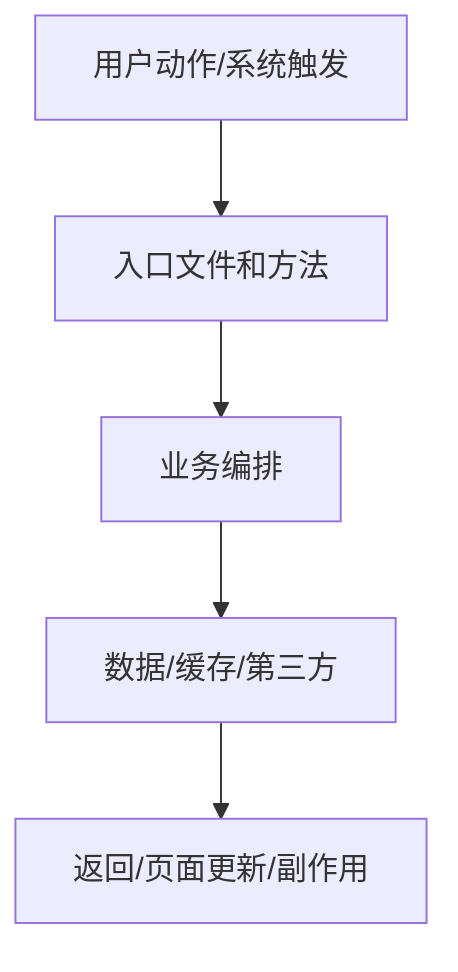

# shuang-code-handoff · 代码链路交付

把一次功能实现、bugfix、页面改造、接口开发、脚本任务或重构整理成可跳转的工程文档，让用户知道本次需求的真实代码入口、执行顺序、关键方法、数据流、验证证据和未覆盖风险。

## 绝对约束

1. **真实代码优先**：先读用户原话、相关文档、git diff、入口文件和关键依赖，再写文档；不知道的地方标“待确认”，不要猜。
2. **只覆盖本需求链路**：不要扫描全仓生成百科式清单；只写本次需求真实相关的入口、方法、数据和副作用。
3. **方法行号最后刷新**：代码修改、格式化或注释补充后，再用最终文件刷新行号。
4. **链接必须可跳转**：代码引用使用绝对路径和行号，例如 `[XxxService.java](/abs/path/XxxService.java:88)`。
5. **验证证据必须真实**：只记录实际运行过的命令、请求、页面检查或明确受阻原因；不用“应该可以”代替证据。
6. **密钥不落文档**：不读取、复述或写入真实 token、签名、密码、`.env.local` 私密值。
7. **源码嵌入优先**：代码链路文档不仅给跳转链接，还要嵌入关键方法源码片段，并围绕完整方法流程逐段解释输入、判断、状态副作用和返回值。
8. **接口联调不混淆**：如果用户要 Apifox、OpenAPI、前端接口联调包，使用或追加 `shuang-api-handoff`。

## 工作流

### 0. 收敛范围

先判断本次文档要解释什么：

- 用户原话和最终目标。
- 本轮新增、修改、删除的文件。
- 虽未改动但属于执行链路的关键依赖。
- 明确不属于本轮范围的路径。

能从代码、spec、tasks、diff、日志或测试结果判断的直接判断；只有范围会影响文档可用性时才问用户。

### 1. 追真实入口

从用户动作或系统触发点向下追，不按文件名堆材料：

| 场景 | 常见入口 |
|---|---|
| 前端页面 | route/page、component、event handler、hook、store、API client |
| 后端接口 | Controller/API route、Param/DTO/VO、Service、Repository/Mapper/XML、Entity |
| 定时/异步 | scheduler、queue consumer、worker、callback、polling、retry job |
| 脚本/CLI | command entry、main function、argument parser、file IO |
| 数据改造 | migration、schema、seed、cache key、message topic、第三方回调 |

### 2. 建方法级链路

按真实执行顺序整理表格：

| 顺序 | 层 | 文件 | 方法/行号 | 职责 | 输入 | 输出/副作用 |
|---|---|---|---|---|---|---|
| 1 | UI/API/Controller | `[file](/abs/path/file:10)` | `method:10` | 入口和校验 | 参数/state | 调用下一层 |
| 2 | Service/Hook | `[file](/abs/path/file:42)` | `method:42` | 编排业务 | DTO/state | 写库/请求/返回 |

行号规则：

- 使用最终文件的真实行号，推荐 `nl -ba <file>`。
- 方法很长时标方法起始行；关键分支额外标分支附近行。
- 不把未读过、未确认相关的文件写进链路。
- 如果链路跨前后端，按用户动作 -> 前端处理 -> API 请求 -> 后端处理 -> 数据/第三方 -> 返回更新的顺序写。

### 3. 写交付文档

优先写到用户指定路径。没有指定时默认：

```text
docs/code-handoff/YYYYMMDD-<feature>.md
```

文档必须包含：

1. **需求摘要**：用户原话、最终实现范围、非目标、当前状态。
2. **阅读入口**：建议先读哪些文件和方法。
3. **文件总览**：新增、修改、关键依赖文件，全部用可点击路径。
4. **入口清单**：页面路由、API 路由、Controller、定时任务、CLI、事件监听、队列消费者等。
5. **方法级代码链路**：文件、方法、真实行号、职责、输入、输出和副作用。
6. **源码嵌入逐段讲解**：按执行顺序贴出关键方法或关键分支代码块，代码块后解释输入来源、关键判断、状态/数据库/第三方副作用、返回值和联调检查点。
7. **数据流**：前端状态、请求参数、DTO/VO、数据库表、缓存、第三方服务、异步消息。
8. **流程图**：至少一个 Mermaid `flowchart TD`；复杂场景增加 `sequenceDiagram` 或 `stateDiagram-v2`。
9. **关键分支和异常路径**：权限、校验、失败重试、幂等、回滚、兜底和兼容逻辑。
10. **验证记录**：实际跑过的 build、test、lint、smoke、接口请求或页面验证。
11. **待确认和风险**：没有验证到的路径、依赖外部环境的假设、后续建议。

### 4. 生成图和数据流

最少生成主流程图：



按需增加：

- 前后端交互：`sequenceDiagram`。
- 订单、任务、审批、生成流程：`stateDiagram-v2`。
- 异步任务：标出同步返回、异步处理、回调或轮询。
- 第三方服务：标出请求、响应和失败处理，不写密钥。

### 5. 记录验证

验证记录格式：

```text
命令/动作 -> 结果
pnpm build -> pass
npm test -- feature.test.ts -> pass
curl /api/foo -> blocked: requires remote token
```

如果无法验证，写清原因和可复验步骤。

## 和其他 skills 的边界

| 需求 | 使用 |
|---|---|
| 解释任意需求的文件、方法、行号、数据流、验证证据 | `shuang-code-handoff` |
| 后端接口给前端联调、字段表、OpenAPI、Apifox JSON | `shuang-api-handoff` |
| 给另一个 AI 生成复制粘贴提示词 | `shuang-prompt` |
| 按 spec/tasks 实现代码 | `shuang-tdd` 或 `speckit-implement` |
| 判断测试缺口并补齐回归 | `shuang-router` 和测试 executor |

## 交付前检查

- 文档链接是否都是绝对路径和真实行号。
- 方法链路是否按执行顺序，而不是按文件名排序。
- 是否只覆盖本需求相关文件。
- 是否包含关键源码片段，并在代码块后解释输入、判断、状态副作用、返回值和联调检查点。
- 是否区分已验证和未验证。
- 是否没有泄露密钥、token、签名或个人敏感数据。
- 如果涉及前端接口联调，是否明确是否需要追加 `shuang-api-handoff`。

## 进化循环

真实使用后，如果用户仍然看不懂执行顺序、行号漂移、流程图缺关键分支，先写：

```text
docs/skill-evolution/inbox/YYYY-MM-DD-code-handoff-<topic>.md
```

只有经验满足长期化标准，再更新本 `SKILL.md` 或拆出 `references/`。不要把一次性业务事实写进 skill。
