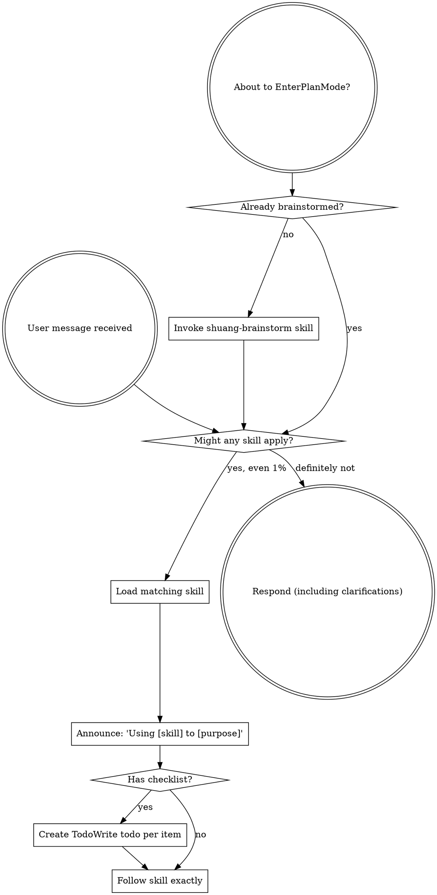

<SUBAGENT-STOP>
If you were dispatched as a subagent to execute a specific task, skip this skill.
</SUBAGENT-STOP>

<EXTREMELY-IMPORTANT>
If you think there is even a 1% chance a skill might apply to what you are doing, you ABSOLUTELY MUST invoke the skill.

IF A SKILL APPLIES TO YOUR TASK, YOU DO NOT HAVE A CHOICE. YOU MUST USE IT.

This is not negotiable. This is not optional. You cannot rationalize your way out of this.
</EXTREMELY-IMPORTANT>

## Instruction Priority

本项目允许在当前环境启用时调用 Superpowers plugin 或 Superpowers skills；用户指令始终优先：

1. **User's explicit instructions** (AGENTS.md, GEMINI.md, AGENTS.md, direct requests) — highest priority
2. **项目 skill** — 只提供流程纪律，不覆盖系统或用户指令
3. **Superpowers skills** — 当任务匹配时作为通用工程纪律补充
4. **Default system prompt** — lowest priority

If AGENTS.md, GEMINI.md, or AGENTS.md says "don't use TDD" and a skill says "always use TDD," follow the user's instructions. The user is in control.

## How to Access Skills

**In Codex:** Skills are discovered and loaded natively by the runtime. When a skill is triggered by name or description, read its current `SKILL.md` and follow it directly; do not assume a separate `Skill` tool exists.

**In Copilot CLI:** Use the `skill` tool. Skills are auto-discovered from installed plugins. The `skill` tool works the same as Codex's `Skill` tool.

**In Gemini CLI:** Skills activate via the `activate_skill` tool. Gemini loads skill metadata at session start and activates the full content on demand.

**In other environments:** Check your platform's documentation for how skills are loaded.

## Platform Adaptation

Skills use Codex tool names. Non-CC platforms: see `references/copilot-tools.md` (Copilot CLI), `references/codex-tools.md` (Codex) for tool equivalents. Gemini CLI users get the tool mapping loaded automatically via GEMINI.md.

## Workbench Capability Boundary

课程、源码解读或其他 AI 工作台里的能力，不能自动视为当前项目可用能力。先按四类判断：

| 能力类型 | 进入位置 | 先验条件 |
|---|---|---|
| 上下文规则 | `AGENTS.md` / `CLAUDE.md` / `@path` 引用 | 只写当前项目真实文件和协作规则 |
| 工具能力 | skill 或项目命令 | 命令、MCP、脚本、配置文件真实存在 |
| 权限/风险门 | skill、hook、CI 或用户确认 | 危险动作有验证或确认门 |
| 自动化护栏 | hook / plugin / CI | 检查可确定、可重复、误阻断成本低 |

能自动判断的结构/校验适合 hook 或 CI；需要产品、架构、长期化判断的，保留为 skill 和确认门。详细路线见 `docs/hooks-and-plugins-roadmap.md`。

如果修改了 `AGENTS.md`、`CLAUDE.md`、hooks/plugins 路线图，或在提示词里声明 hook、plugin、MCP、slash command、subagent 已启用，先跑：

```bash
node scripts/agent-workbench-boundary-check.mjs
```

# Using Skills

## The Rule

**Invoke relevant or requested skills BEFORE any response or action.** Even a 1% chance a skill might apply means that you should invoke the skill to check. If an invoked skill turns out to be wrong for the situation, you don't need to use it.

## Progressive Loading Discipline

- `description` 只用于判断是否触发，不当成完整流程执行。
- 触发后必须读取当前 `SKILL.md`，再按正文行动。
- `SKILL.md` 保留核心步骤；长案例、课程提炼、工具细节放到 `references/`、`docs/` 或 `scripts/`。
- 当用户提供课程资料来完善 skill 时，先用 `shuang-evolve` 写 evolution note；不要把课程原文、PDF 正文、截图或一次性案例直接塞进通用 skill。
- 如果一个规则只适合某个项目，放项目 `AGENTS.md` / `CLAUDE.md`；只有跨项目复用才进入 `.codex/skills/`。

## Description Trigger Audit

创建或修改 skill 的 `description` 时，按下面检查：

- 它回答的是“什么时候应该加载这个 skill”，不是“这个 skill 的完整执行流程”。
- 保留用户会说的触发词、问题症状、上下文边界和英文关键词。
- 避免把 `先...再...最后...` 的步骤链写进 description；步骤放 `SKILL.md` 正文。
- 如果需要超过 2 句话解释流程，移到 `references/` 或 `docs/`。
- `node scripts/validate-skills.mjs` 会拦截 description 里的明显步骤链；不要为了通过检查改成同义流程摘要。
- 改完先跑 `node scripts/agent-workbench-boundary-check.mjs` 和 `node scripts/validate-skills.mjs`；已经安装到业务项目时，再用 `scripts/shuang-skill-manager.mjs install --target <project>` 同步。



## Red Flags

These thoughts mean STOP—you're rationalizing:

| Thought | Reality |
|---------|---------|
| "This is just a simple question" | Questions are tasks. Check for skills. |
| "I need more context first" | Skill check comes BEFORE clarifying questions. |
| "Let me explore the codebase first" | Skills tell you HOW to explore. Check first. |
| "I can check git/files quickly" | Files lack conversation context. Check for skills. |
| "Let me gather information first" | Skills tell you HOW to gather information. |
| "This doesn't need a formal skill" | If a skill exists, use it. |
| "I remember this skill" | Skills evolve. Read current version. |
| "This doesn't count as a task" | Action = task. Check for skills. |
| "The skill is overkill" | Simple things become complex. Use it. |
| "I'll just do this one thing first" | Check BEFORE doing anything. |
| "This feels productive" | Undisciplined action wastes time. Skills prevent this. |
| "I know what that means" | Knowing the concept ≠ using the skill. Invoke it. |

## Skill Priority

When multiple skills could apply, use this order:

1. **Process skills first** (shuang-brainstorm, debugging) - these determine HOW to approach the task
2. **Implementation skills second** (frontend-design, mcp-builder) - these guide execution

"Let's build X" → shuang-brainstorm first, then implementation skills.
"Fix this bug" → debugging first, then domain-specific skills.

## Skill Types

**Rigid** (TDD, debugging): Follow exactly. Don't adapt away discipline.

**Flexible** (patterns): Adapt principles to context.

The skill itself tells you which.

## User Instructions

Instructions say WHAT, not HOW. "Add X" or "Fix Y" doesn't mean skip workflows.
