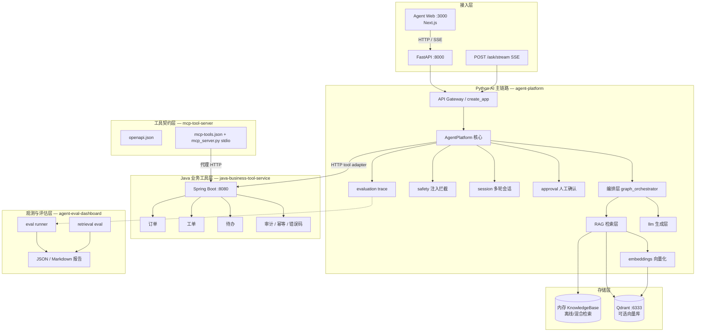

# 项目架构总览

> 版本：2026-07-01。本文是 **work/ai-agent** 的顶层架构定稿，后续 feature、学习和求职表达都以此为准。  
> 技术栈决策见 [decisions/0001-python-java-hybrid.md](decisions/0001-python-java-hybrid.md)。

---

## 1. 工作区边界

整个 `shuang-agent` 工作区分两层，职责不可混淆：

```text
shuang-agent/
├── agent/                 # 课程资料库（只读引用，不修改）
└── work/ai-agent/         # 求职作品集 + 学习计划 + 运行时代码（本项目管理区）
    ├── portfolio/         # 可运行代码
    ├── specs/             # Feature 规格与 TDD 任务
    ├── docs/              # 规划、架构、求职文档
    ├── scripts/           # 自动化脚本
    └── logs/              # 学习/行业/投递日志
```

**原则：** `agent/` 是输入，`work/ai-agent/` 是输出。不在父级课程目录里写项目代码。

---

## 2. 一句话定位

**企业知识库 AI Agent Platform**：Python 负责 Agent/RAG/评估/AI API，Java 负责企业业务工具，MCP/OpenAPI 定义工具边界，Eval 体系证明效果，Docker Compose 证明可部署。

不是聊天 Demo，而是 **可检索、可调用、可拒答、可审批、可追踪、可评估、可部署** 的 AI 应用工程样例。

---

## 3. 分层架构



---

## 4. 四大运行时组件

| 组件 | 路径 | 端口 | 职责 | 状态 |
|---|---|---:|---|---|
| **Agent Web** | `portfolio/agent-web/` | 3000 | Next.js 控制台：对话、流式、入库、审批、指标 | ✅ MVP 完成 |
| **Agent Platform** | `portfolio/agent-platform/` | 8000 | RAG、编排、安全、会话、审批、API、trace | ✅ MVP 完成 |
| **Java Business Tool Service** | `portfolio/java-business-tool-service/` | 8080 | 订单/工单/待办、幂等、审计、错误码 | ✅ MVP 完成 |
| **MCP Tool Server** | `portfolio/mcp-tool-server/` | stdio | OpenAPI 合约 + MCP 运行时代理 Java | ✅ MVP 完成 |
| **Agent Eval Dashboard** | `portfolio/agent-eval-dashboard/` | CLI | Agent eval + 检索 eval 报告 | ✅ MVP 完成 |
| **Qdrant** | `compose.yaml` | 6333 | 向量存储（可选） | ✅ Compose 接入 |

---

## 5. Python 内部模块地图

`portfolio/agent-platform/src/agent_platform/` 按职责分层：

```text
接入层
  api.py              FastAPI 路由：/health /documents /ask /ask/stream /sessions /approvals /summary /tools

核心域
  agent.py            AgentPlatform：ask / ask_stream / confirm_approval / ingest / summary
  models.py           Document, RetrievedChunk, ToolCall, AgentTrace, AgentResponse ...

编排层
  graph_orchestrator.py   LangGraph 风格状态机：safety → retrieve → tools → compose

安全与会话
  safety.py           Prompt 注入规则拦截
  session.py          内存多轮会话（最多 5 轮）
  approval.py         Human-in-the-loop 写操作审批

RAG 层
  knowledge_base.py   文档切分与内存 chunk 存储
  document_parser.py  Markdown / PDF(base64) 解析
  retrieval.py        BM25 + LocalVector + HybridRetriever
  vector_store.py     QdrantVectorIndex + HashingEmbedding 接入点
  embeddings.py       HashingEmbedding / OpenAI-compatible Embedding

工具层
  tools.py            离线确定性工具注册表
  java_tools.py       Java HTTP 工具适配器

模型层
  llm.py              OpenAI-compatible Chat（同步 + 流式）

横切
  evaluation.py       trace 记录与 summary 统计
  streaming.py        SSE 事件格式化
```

**依赖方向（只允许向下）：** `api → agent → {orchestrator, retrieval, tools, llm, safety, session, approval} → models`

---

## 6. 三条核心数据流

### 6.1 问答主链路（POST /ask）

```text
用户 question
  → [safety] 注入检测 ──blocked──→ 拒答
  → [approval] 写操作检测 ──pending──→ 返回 approval_id
  → [retrieve] 混合检索 / Qdrant 向量检索
  → [tools] 订单/工单/待办工具调用
  → [compose] 离线模板 或 LLM 生成
  → AgentResponse（引用 + trace + session_id）
  → evaluation 记录
```

流式版本 `POST /ask/stream`：同样前置逻辑，生成阶段改为 SSE `meta → token → done`。

### 6.2 文档入库（POST /documents）

```text
DocumentPayload（content + content_type）
  → document_parser（text/markdown/pdf）
  → knowledge_base.ingest（切分）
  → [可选] QdrantVectorIndex.upsert（embedding → 向量库）
```

### 6.3 工具调用链

```text
Agent 识别意图
  → 读操作：tools.invoke → JavaBusinessToolRegistry HTTP → Java :8080
  → 写操作：approval.create → 用户 confirm → tools.execute → Java :8080
  → [并行路径] MCP Client → mcp_server.py → Java :8080
```

---

## 7. 环境驱动的运行模式

`api.create_app()` 根据环境变量组合出不同运行形态：

| 模式 | 条件 | 检索 | 工具 | 生成 |
|---|---|---|---|---|
| **离线演示** | 无 env | HybridRetriever（内存） | 离线 BusinessToolRegistry | 模板拼接 |
| **+ Java 工具** | `JAVA_TOOL_BASE_URL` | 同上 | Java HTTP | 模板 / LLM |
| **+ Qdrant** | `QDRANT_BASE_URL` | QdrantRetriever | 离线或 Java | 模板 / LLM |
| **+ 真实 LLM** | `OPENAI_API_KEY` + `OPENAI_MODEL` | 取决于上项 | 取决于上项 | Chat Completion |
| **+ 真实 Embedding** | `OPENAI_EMBEDDING_MODEL` | 真实向量 | 取决于上项 | 取决于上项 |
| **Compose 全栈** | `compose.yaml` | Qdrant + Java 工具 | Java HTTP | 模板（默认） |

**设计原则：** 默认离线可测（无 key、无网络），通过 env 渐进接入真实依赖。

---

## 8. 评估体系位置

评估不是附属脚本，而是架构中的 **质量门禁**：

```text
agent-platform/data/eval_dataset.jsonl          → Agent eval（20 cases）
agent-platform/data/retrieval_eval_dataset.jsonl → Retrieval eval（5 cases）

agent-eval-dashboard/
  runner.py           读取 JSONL → 调 AgentPlatform → 输出指标
  retrieval_eval.py   对比 keyword vs hybrid 模式
  reports/latest.md   pass_rate / refusal_rate / tool_success_rate
```

当前基线：Agent pass_rate=100%，hybrid hit_rate=100%，MRR=0.9。

---

## 9. 部署拓扑（Docker Compose）

```text
                    ┌─────────────────┐
                    │    agent-web    │ :3000
                    │   (Next.js)     │
                    └────────┬────────┘
                             │ HTTP / SSE
                    ┌────────▼────────┐
                    │  agent-platform │ :8000
                    │    (Python)     │
                    └────────┬────────┘
              HTTP tools     │      vector query/upsert
                    ┌────────▼────────┐     ┌──────────┐
                    │ java-business-  │     │  Qdrant  │ :6333
                    │ tool-service    │     └──────────┘
                    │ (Spring Boot)   │
                    └─────────────────┘ :8080
```

---

## 10. 架构边界（已定，不争论）

| 边界 | 决策 |
|---|---|
| AI 主链路语言 | **Python**（不是 Java，不是 TS 替代 Java） |
| 业务工具语言 | **Java Spring Boot** |
| 工具协议 | **HTTP + OpenAPI + MCP**（Agent 不直连数据库） |
| 写操作 | **必须 Human-in-the-loop**（当前：create_todo） |
| 安全 | **规则拦截在检索/工具之前**（后续可叠加 LLM 分类器） |
| 默认运行 | **离线确定性**（测试不依赖外网） |
| 课程资料 | **`agent/` 只读** |

---

## 11. 当前 vs 下一阶段

### 已完成（架构上可讲、有测试证据）

- [x] Python Agent 核心 + FastAPI
- [x] 混合检索 + Qdrant 可选接入
- [x] OpenAI-compatible Chat + Embedding 双适配
- [x] Java 业务工具服务 + HTTP 适配
- [x] MCP 合约 + stdio Server
- [x] Prompt 安全 + 多轮会话 + HITL 审批
- [x] SSE 流式 + LangGraph 风格编排
- [x] Eval Dashboard + Docker Compose
- [x] 行业资讯自动化 + 技能矩阵/求职材料

### 下一阶段（按优先级，不并行铺开）

| 优先级 | 能力 | 落点 | 说明 |
|---|---|---|---|
| P1 | LangChain/LangGraph 官方包 | `agent-platform` 编排层 | 替换/增强自研状态机 |
| P1 | 真实 Rerank 模型 | `retrieval.py` | 替换轻量规则 rerank |
| P1 | CI test workflow | `.github/workflows/` | 推送自动跑 61+ tests |
| P2 | Redis 会话持久化 | `session.py` | 多实例部署前置 |
| P2 | 鉴权 / 多租户 | `api.py` + Java 服务 | 生产化 |
| P2 | Web 前端 | `portfolio/agent-web/` | 展示层，不替代 Java | **MVP 完成** |
| P3 | LlamaIndex 接入 | 文档入库实验 | 与自研 RAG 对比 |
| P3 | K8s / 监控 | 部署层 | 第二 sprint |

### 明确不做（第一个月）

- Spring AI 重写主 RAG 链路
- 自训练 / 微调模型
- 同时铺开 AutoGen + CrewAI + Haystack
- 无 eval 的 Prompt Demo

---

## 12. 与求职材料的映射

面试讲架构时按此顺序：

1. **业务问题** → 企业知识散落 + 需查实时业务数据
2. **分层** → Python AI / Java 工具 / MCP 边界 / Eval 质量门禁
3. **主链路** → 安全 → 检索 → 工具 → 生成 → trace
4. **差异化** → HITL 写操作审批 + eval 数据 + 混合架构
5. **证据** → GitHub 开源、Compose 一键启动、61+ tests

详见 [11-resume-and-interview-pack.md](11-resume-and-interview-pack.md)。

---

## 13. 相关文档索引

| 文档 | 用途 |
|---|---|
| [03-architecture-overview.md](03-architecture-overview.md) | **本文：顶层架构定稿** |
| [decisions/0001-python-java-hybrid.md](decisions/0001-python-java-hybrid.md) | 技术栈决策记录 |
| [tech-stack-roadmap.md](tech-stack-roadmap.md) | 分阶段技术学习路线 |
| [portfolio-projects.md](portfolio-projects.md) | 作品集交付标准 |
| [portfolio/agent-platform/docs/architecture.md](../portfolio/agent-platform/docs/architecture.md) | Python 侧实现备注 |
| [specs/](../specs/) | 各 feature 的 spec/plan/tasks |
