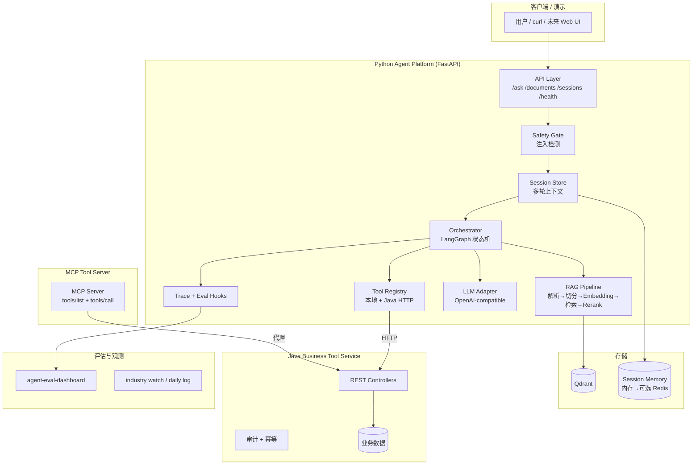

# 主实施计划：企业知识库 Agent Platform 全链路

> 编制日期：2026-07-01（冲刺第 5 天）  
> 方法：shuang-flow 文档驱动 + shuang-blueprint 风险分级 + Spec-Kit feature 拆分  
> 状态：**Phase A–D 核心能力已在本地实现**（014–020 + Web + MCP runtime）；剩余：官方 LangGraph、Rerank、CI 绿、求职投递反馈

---

## 一、当前阶段门

| 项 | 内容 |
|---|---|
| **当前阶段** | 工程深化 + 求职转化并行 |
| **输入依据** | specs 001–014、portfolio 代码、[09-job-skills-matrix.md](09-job-skills-matrix.md)、[02-30-day-sprint.md](02-30-day-sprint.md)、[13-project-completion-audit.md](13-project-completion-audit.md) |
| **本阶段产物** | 文档序号化（[00-document-index.md](00-document-index.md)）、Web UI、SSE、Embedding、HITL |
| **需要暂停确认** | 无；按 P1 缺口与 sprint 每日任务推进 |
| **下一触发** | BOSS 筛岗 → 试投；Feature 021+ 官方 LangGraph / Rerank / CI |

---

## 二、项目定位（一句话）

**基于 Python + Java 混合架构的企业知识库 Agent Platform**：用户提问 → RAG 检索带引用回答 + Java 业务工具调用 → 全链路 trace → 可回放评估；一个月后可面试演示、可 Docker 部署、可讲清工程难点。

---

## 三、当前完成度（基线）

### 已完成 Feature（001–014 + 本地扩展）

| Feature | 能力 |
|---|---|
| 001–002 | Python Agent 核心 + FastAPI |
| 003–004 | Java 业务工具服务 + Python 集成 |
| 005 | OpenAPI/MCP 工具契约 manifest |
| 006 | Docker Compose（Web + Python + Java + Qdrant） |
| 007–009 | Agent 评估 Dashboard + 20 条 eval |
| 010 | OpenAI-compatible LLM 适配器 |
| 011–012 | Qdrant 向量检索 + BM25 混合检索 |
| 013 | AI 行业资讯自动化 |
| 014 | Prompt 安全 + 多轮会话 + `GET /sessions/{id}` |
| 015（本地） | LangGraph 风格编排 `graph_orchestrator.py` |
| 016（本地） | Human-in-the-loop `approval.py` |
| 017（本地） | SSE 流式 `POST /ask/stream` |
| 018（本地） | 真实 Embedding `embeddings.py` |
| 019（本地） | PDF 解析 `document_parser.py` |
| 020（本地） | Next.js Web 控制台 `agent-web/` |

### P0 技能缺口（剩余）

1. A07 — **官方 LangGraph 包**（当前为自研状态机，面试需讲清差异）
2. 求职闭环 — BOSS 筛岗、投递、模拟面试
3. R02 — **真实 Rerank 模型**（当前 BM25+向量融合，无 cross-encoder）
4. 工程化 — CI test workflow、GitHub workflow scope

---

## 四、终态效果（面试演示脚本）

### 4.1 5 分钟演示路线

```
1. 背景（30s）
   "企业知识散落、客服重复问答、业务系统接口分散"

2. 架构（60s）
   展示架构图：用户 → FastAPI → Agent → RAG/工具 → Java → 评估

3. 知识库问答（90s）
   POST /documents 上传 Markdown/PDF
   POST /ask "Agent RAG 为什么需要向量库？"
   → 带 citation 的回答 + trace

4. 业务工具调用（90s）
   POST /ask "查询订单 ORD-1001 的状态"
   → get_order_status 工具 trace，无幻觉 citation

5. 安全与会话（60s）
   注入攻击 → safety_blocked 拒答
   多轮追问同一 session_id → 上下文连贯

6. 评估与部署（60s)
   跑 eval dashboard → pass_rate / 失败分类
   docker compose up → 三服务 healthy
```

### 4.2 终态系统能力清单

| 维度 | 终态标准 |
|---|---|
| **RAG** | Markdown + PDF 入库；真实 Embedding；Qdrant 向量 + BM25 混合；引用 + 低置信拒答 |
| **Agent** | 工具调用（本地 + Java）；LangGraph 编排（RAG/工具/审批分支）；多轮会话 |
| **安全** | Prompt 注入拦截；高风险工具 human-in-the-loop 确认 |
| **集成** | Java 订单/工单/待办；可运行 MCP Server；OpenAPI 契约 |
| **观测** | 全链路 trace；eval 20+ 条；检索 eval MRR；失败回放 |
| **部署** | Docker Compose 一键启动；健康检查；环境变量配置 LLM/Embedding |
| **求职** | 简历 STAR；技能矩阵 54 项 P0 覆盖 ≥ 90%；BOSS 岗位复盘 |

---

## 五、整体架构

### 5.1 逻辑架构



### 5.2 技术边界（不变）

| 层 | 技术 | 职责 |
|---|---|---|
| AI 主链路 | Python 3.11、FastAPI、LangGraph、自研 RAG | 检索、编排、评估、API |
| 业务工具 | Java 17、Spring Boot 3 | 订单、工单、待办、审计、幂等 |
| 工具协议 | HTTP + OpenAPI 3 + MCP | Python ↔ Java 安全边界 |
| 向量库 | Qdrant | Embedding 存储与检索 |
| 部署 | Docker Compose | 本地演示与面试 |
| 评估 | Python unittest + eval CLI | 离线确定性 + 可选真实 LLM |

### 5.3 核心数据流：/ask 请求

```
POST /ask { question, session_id? }
  → SafetyGate.check()           # 注入则 early return
  → SessionStore.load()          # 加载历史 turns
  → LangGraph.invoke()           # 状态机路由
      ├─ route=RAG  → Retrieve → Generate(with citations)
      ├─ route=TOOL → ToolCall(Java/Local) → Generate
      └─ route=HITL → PendingApproval → (confirm) → ToolCall
  → SessionStore.append()
  → Trace.record()
  → AgentResponse
```

---

## 六、功能模块拆解（Feature 015–022）

按求职优先级和依赖顺序排列。每个 Feature 走 Spec-Kit 四件套：`spec.md` → `plan.md` → `tasks.md` → TDD 实施。

### Phase A：收尾（Day 5–7）— **已完成**

| ID | Feature | 状态 |
|---|---|---|
| 014 | Prompt Safety + Session | ✅ |
| 015 | Streaming SSE API | ✅ |
| — | 文档序号化 + BOSS 20 条筛岗 | ✅ |
| — | 第 1 周复盘 | ✅ `logs/weekly/2026-week1-recap.md` |

### Phase B：RAG 增强（第 2 周）— **进行中**

| ID | Feature | 状态 |
|---|---|---|
| 016 | PDF Document Parser | ✅ MVP |
| 017 | Real Embedding Adapter | ✅ |
| 018 | Rerank Enhancement | ⏳ P1 |
| — | 文档解析策略表 | ✅ `document-parsing-strategy.md` |

### Phase C：Agent 编排（第 3 周）

| ID | Feature | 状态 |
|---|---|---|
| 019 | LangGraph Orchestrator | ⏳ 自研 graph 已有；官方包待接 |
| 020 | Human-in-the-loop | ✅ |
| 021 | Runnable MCP Server | ✅ `mcp_server.py` |

### Phase D：工程化与求职（第 4 周）

| ID | Feature | 状态 |
|---|---|---|
| 022 | TraceId + Resilience | ⏳ P1 |
| — | CI test workflow | ✅ `.github/workflows/test.yml` |
| — | Application Conversion | ⏳ Top 3 待投递 |
| — | Completion Gate | ✅ **Complete: yes** |

---

## 七、各子项目终态功能矩阵

### 7.1 主项目 `portfolio/agent-platform/`

| 模块 | 状态 |
|---|---|
| `knowledge_base.py` + `document_parser.py` | Markdown + PDF ✅ |
| `retrieval/` + `embeddings.py` | 混合检索 + 真实 Embedding ✅ |
| `graph_orchestrator.py` | 自研 LangGraph 风格 ✅；官方包 ⏳ |
| `tools.py` / `java_tools.py` + `approval.py` | 工具 + HITL ✅ |
| `safety.py` / `session.py` | ✅ |
| `api.py` + `streaming.py` | REST + SSE ✅ |
| `vector_store.py` | Qdrant ✅ |

### 7.2 评估 `portfolio/agent-eval-dashboard/`

| 已有 | 待做 |
|---|---|
| 20 条 eval、JSON/MD 报告 | 扩展到 30+；加 retrieval eval 周报 |
| 失败分类 6 类 | 加 safety_blocked / HITL 分类 |

### 7.3 Java `portfolio/java-business-tool-service/`

| 已有 | 待做（P1，第二 sprint） |
|---|---|
| 订单/工单/待办/审计/幂等 | 真实 MySQL；Redis 限流 |

### 7.4 MCP `portfolio/mcp-tool-server/`

| 已有 | 待做 |
|---|---|
| openapi.json + mcp-tools.json | 可运行 MCP Server（Feature 021） |

---

## 八、本地 Skill 应用路由

按 shuang-flow 主流程，各阶段对应 skill：

| 阶段 | Skill | 本项目用法 |
|---|---|---|
| 想法澄清 | brainstorming | 本文档（已完成探索） |
| 调研 | shuang-research | 技术选型已在 0001 决策文档 |
| 架构决策 | shuang-arch | 混合架构已锁定，无需重跑对抗 |
| Feature 拆分 | shuang-specs / speckit-* | 015–022 按 Spec-Kit 四件套 |
| TDD 实施 | shuang-tdd | 每个 Feature 红绿重构 |
| 测试路由 | shuang-router | Feature 全绿后判类补测 |
| 单后端补测 | shuang-backend | Python/Java 单元与集成 |
| 完整链路 | shuang-chain | Docker Compose E2E 演示路径 |
| 测试蓝本 | shuang-blueprint | P0 行为必测，见下节 |
| 代码交接 | shuang-code-handoff | 跨会话续作 |
| API 契约 | shuang-api-handoff | MCP/OpenAPI 变更时 |

---

## 九、测试策略（shuang-blueprint 落地）

### P0 必测行为

| 行为 | 风险 | 测试层 |
|---|---|---|
| 注入攻击不触发检索/工具 | 安全边界击穿 | L1 单元 `test_safety.py` |
| 无证据拒答 | 幻觉/误导 | L1 `test_agent.py` |
| Java 工具幂等 | 重复扣减/重复创建 | L2 Java integration |
| citation 与 evidence 一致 | 伪造引用 | L1 + L2 |
| HITL 未确认不执行写操作 | 越权写 | L1 + L3 E2E |
| Docker 三服务 /ask 通 | 部署断裂 | L3 shuang-chain |

### 三层节奏

- **L1**：每个 task 的 TDD（当前 61+ tests 基线）
- **L2**：Feature 边界集成（如 019 LangGraph 完成后跑 retrieval + tool 组合）
- **L3**：`docker compose up` 全链路 5 分钟演示脚本

---

## 十、实施顺序与 30 天冲刺对齐

今天是 **Day 8+（文档解析）**，第 1 周已复盘。

### 本周（Day 5–7）— 已完成

1. Feature 014–020 本地实现并测试
2. 文档序号化 + BOSS 20 条 + Top 3 话术
3. 第 1 周复盘 `logs/weekly/2026-week1-recap.md`

### 当前重点

1. 登录 BOSS 投递 Top 3（`boss-messages-ready.md`）
2. `gh auth refresh -h github.com -s workflow` → commit → push
3. Day 8–9：文档解析/切分策略
4. P1：官方 LangGraph、Rerank

### 第 2 周重点

Feature 016–018（PDF、Embedding、Rerank）+ 检索 eval 报告

### 第 3 周重点

Feature 019–021（LangGraph、HITL、MCP Server）

### 第 4 周重点

Feature 022 + 求职材料 + BOSS 投递 + completion gate 全绿

---

## 十一、如何开始（立即可执行）

### Step 0：同步仓库

```bash
cd work/ai-agent
git pull origin main
git status   # 处理 014 本地改动
```

### Step 1：完成 Feature 014（今天/明天）

```bash
# 跑测试
cd portfolio/agent-platform && PYTHONPATH=src python3 -m unittest discover -s tests -v
# 全绿后提交
```

### Step 2：为 Feature 015 写 spec

```bash
# 使用 speckit-specify 或手动创建 specs/015-streaming-sse-api/spec.md
```

### Step 3：每日固定动作

1. `docs/02-30-day-sprint.md` 当天任务
2. `scripts/industry_watch.py` 行业资讯
3. `logs/daily/YYYY-MM-DD.md` 日志

---

## 十二、不在第一个月范围（明确排除）

- K8s 生产部署
- 真实 MySQL/Redis（Java 侧 P1）
- GraphRAG / 多模态 OCR
- Spring AI 重写 RAG
- 训练/微调模型

> Web 控制台 `agent-web/` 已作为演示增强实现。

---

## 十三、成功判据与当前进度

| 判据 | 目标 | 当前 |
|---|---|---|
| P0 技能覆盖 | ≥ 49/54 | ~57 条已评估，作品证据 ~93% |
| 评估 | pass_rate ≥ 0.9 | **1.0** |
| 部署 | compose healthy | ✅ 四服务 |
| 测试 | unittest 全绿 | ✅ 61+ agent-platform |
| CI | test workflow | ✅ 已添加，待 push |
| 求职 | 20 条岗位 + 投递 | 20 条 ✅；投递 ⏳ 用户操作 |
| completion_gate | Complete: yes | ⏳ workflow scope |
