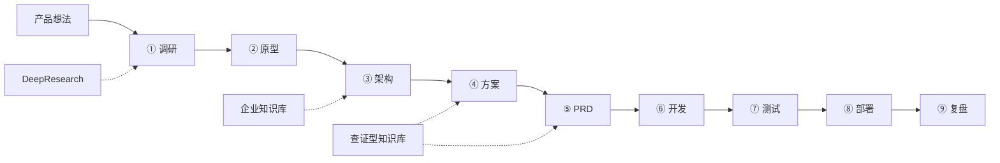

# ProjectForge Agent 主计划：全链路造物智能体

> 编制日期：2026-07-01  
> 状态：**Phase A 进行中**（工作台 UI + 查证型知识库数据结构 + 演示链路）  
> 定位：简历核心项目 — 用 AI 完成从需求调研到上线部署的 vibe coding 流水线

---

## 一、一句话定位

**ProjectForge Agent** 是多阶段 Agent 编排系统：输入一个产品想法，自动走完需求调研 → 原型 → 架构选型 → PRD → 开发 → 测试 → 部署，输出可运行仓库与文档包；内置 **DeepResearch**、**企业知识库 RAG**、**查证型知识库** 三大能力引擎，全程可追溯、可核验、代码规范门禁。

**不是 SaaS 产品**，是个人 AI 工程放大器（道法术中的「术」）。

---

## 二、道法术

| 层 | 含义 | 落地 |
|---|---|---|
| **道** | 用 AI 放大个人全栈工程能力 | 一句话需求 → 可部署项目 |
| **法** | Spec 驱动、TDD、可追溯、可部署 | 每阶段结构化产出 + eval + trace |
| **术** | 多 Agent 流水线 + 三大知识引擎 | 本文档各章节 |

---

## 三、九大工程阶段

| # | 阶段 | Agent | 主要产出 | 依赖能力 |
|---|---|---|---|---|
| 1 | 需求调研 | Research Agent | 竞品表、痛点、脚注调研报告 | DeepResearch |
| 2 | 画面原型 | UX Agent | 页面结构、线框、组件清单 | — |
| 3 | 架构选项 | Architect Agent | 2～3 套方案对比、ADR 推荐 | 企业知识库 |
| 4 | 解决方案 | Architect Agent | 模块边界、API 契约、数据流图 | 查证型知识库 |
| 5 | PRD 书写 | PRD Agent | 前端 PRD + 后端 PRD + 验收标准 | 查证型知识库 |
| 6 | 代码开发 | Dev Agent | 按模块代码、匹配仓库规范 | Code Constitution |
| 7 | 测试 | QA Agent | 单测/集成测、失败分类 | TDD 门禁 |
| 8 | 上线部署 | DevOps Agent | Docker/CI、健康检查、URL | compose |
| 9 | 复盘 | Supervisor | 阶段耗时、幻觉点、改进项 | 全链路 trace |



---

## 四、三大能力引擎（非独立 SaaS）

### 4.1 企业知识库 RAG

- **路径**：`portfolio/agent-platform/`（已有）
- **作用**：检索内部文档、课程笔记、项目 spec
- **能力**：Markdown/PDF 入库、混合检索、citation、低置信拒答
- **文档**：`docs/document-parsing-strategy.md`、`answer-strategy.md`

### 4.2 查证型知识库 Verified Knowledge

- **路径**：`portfolio/agent-platform/src/agent_platform/verified_knowledge.py`
- **作用**：Claim → Evidence 对齐 → 置信度门控
- **API**：`POST /verified-knowledge/verify`
- **规格**：见本文档 §五

### 4.3 DeepResearch Agent

- **路径**：`capabilities/deep-research/`（待建）
- **作用**：多轮外网搜索、子问题拆解、脚注报告
- **课程蓝本**：`agent/part22-agent-workspace/案例4：DeepResearch+Agent`
- **状态**：Phase C

---

## 五、查证型知识库数据结构

### 5.1 核心类型

```text
Claim                  # 待核验主张（架构断言、PRD 条目等）
Evidence               # 证据片段（知识库 chunk / 调研来源）
ClaimEvidenceLink      # 主张-证据对齐关系与分数
VerifiedClaim          # 单条主张的核验结果
VerificationReport     # 一批主张的整体报告
```

### 5.2 字段定义

| 类型 | 关键字段 | 说明 |
|---|---|---|
| `Claim` | `claim_id`, `text`, `source_stage`, `context` | 从 PRD/架构文档抽取的句子级主张 |
| `Evidence` | `evidence_id`, `doc_id`, `chunk_id`, `snippet`, `score`, `source_type` | `knowledge_base` / `deep_research` / `manual` |
| `ClaimEvidenceLink` | `relation`, `alignment_score`, `rationale` | `supports` / `partial` / `contradicts` / `unrelated` |
| `VerifiedClaim` | `status`, `confidence`, `top_evidence` | `verified` / `weak` / `unverified` / `contradicted` |
| `VerificationReport` | `overall_confidence`, `should_refuse`, `summary` | 低于阈值则 `should_refuse=true` |

### 5.3 核验流程

```text
输入文本
  → 抽取 Claim 列表（句子切分 / 未来 LLM）
  → 对每个 Claim 检索 KnowledgeBase Top-K
  → 计算 term-overlap 对齐分 + relation 分类
  → 聚合为 VerifiedClaim
  → 输出 VerificationReport（含拒答建议）
```

### 5.4 阈值（可调）

| 参数 | 默认值 | 含义 |
|---|---|---|
| `verify_threshold` | 0.55 | 单条 claim 视为 verified 的最低分 |
| `refuse_threshold` | 0.35 | 整体置信低于此值建议拒答/人工复核 |
| `min_evidence_score` | 0.15 | 证据检索最低相关分 |

---

## 六、代码规范门禁（Code Constitution）

| 规则 | 落地 |
|---|---|
| 先 spec 后 code | `specs/` + Spec-Kit 四件套 |
| TDD | 红绿重构，CI `test.yml` |
| API 契约先行 | OpenAPI / Pydantic / TypeScript types |
| 安全 | `safety.py` 注入门；写操作 HITL |
| 可追溯 | trace + citation + verification report |
| 无密钥入库 | 环境变量注入 |

---

## 七、仓库结构演进

```text
work/ai-agent/
├── docs/17-project-forge-master-plan.md   # 本文档
├── portfolio/agent-platform/
│   └── src/agent_platform/
│       ├── verified_knowledge.py            # 查证型 ✅ Phase A
│       └── project_forge.py                 # 九阶段编排 ✅ Phase A
├── portfolio/agent-web/
│   └── src/components/ProjectForgeWorkbench.tsx
└── capabilities/                            # Phase B+
    ├── deep-research/
    └── project-forge/artifacts/
```

---

## 八、实施阶段

### Phase A：能投简历（当前）

- [x] 本文档
- [x] `verified_knowledge.py` 数据结构 + 核验 API
- [x] `project_forge.py` 九阶段演示链路
- [x] Web ProjectForge 工作台第一版
- [ ] 公网部署 + 5 分钟演示录屏
- [ ] 简历 STAR 更新（`11-resume-and-interview-pack.md`）

### Phase B：查证深化

- [ ] PRD/架构阶段强制走查证门
- [ ] Web 展示 Claim-Evidence 对照表
- [ ] eval 数据集增加 verification 指标

### Phase C：DeepResearch 接入

- [ ] 调研阶段自动出脚注报告
- [ ] 报告引用进 PRD

### Phase D：Dev/QA/Ops Agent 自动化

- [ ] 与 Cursor/Codex Skill 打通
- [ ] 真实代码生成 + CI 绿才进部署阶段

---

## 九、演示链路（Phase A 默认剧本）

**场景**：用 ProjectForge 完善 ai-agent 的查证型知识库能力（meta 演示，面试故事最强）

```text
输入：「为 agent-platform 增加查证型知识库，让架构和 PRD 结论可核验」

① 调研  → DeepResearch 风格摘要（竞品：RAG vs GraphRAG vs 查证）
② 原型  → 工作台页面结构（9 阶段 + 查证面板）
③ 架构  → 三方案对比（内嵌模块 / 独立服务 / 插件）
④ 方案  → 选定内嵌模块 + Claim-Evidence 数据流
⑤ PRD   → 前后端接口 + 验收标准（经查证门）
⑥ 开发  → verified_knowledge.py + API + 测试
⑦ 测试  → unittest 覆盖核验阈值
⑧ 部署  → docker compose 现有栈
⑨ 复盘  → 阶段 trace + 下一步 DeepResearch
```

**API**：`POST /project-forge/demo`

---

## 十、简历写法

```text
【核心】ProjectForge Agent — 全链路 AI 工程工作台
- 九阶段 Agent 编排：调研→原型→架构→PRD→开发→测试→部署→复盘
- 内置 DeepResearch、企业知识库 RAG、查证型知识库（Claim-Evidence 对齐）
- Python FastAPI + Qdrant + Next.js + Java 工具层，70+ 自动化测试
- 演示：https://forge.xxx.com | 源码：github.com/SunnySLJ/ai-agent
```

---

## 十一、面试 5 分钟脚本

1. **痛点**（30s）：一个人做产品，调研到上线链路太长  
2. **架构**（60s）：九阶段 + 三引擎 + 查证门 + Code Constitution  
3. **Demo**（90s）：输入想法 → 阶段产物滚动 → 查证面板 → 测试绿 → compose up  
4. **难点**（60s）：幻觉、阶段漂移、烂代码 → 查证 + TDD + trace  
5. **结果**（30s）：个人 AI 工程流水线，不是聊天机器人  

---

## 十二、关联文档

| 文档 | 关系 |
|---|---|
| [18-project-first-daily-plan.md](18-project-first-daily-plan.md) | **6 周每日学习与开发计划（执行入口）** |
| [16-master-implementation-plan.md](16-master-implementation-plan.md) | 企业知识库底座 |
| [06-portfolio-projects.md](06-portfolio-projects.md) | 作品集标准（将更新为核心 ProjectForge） |
| [09-job-skills-matrix.md](09-job-skills-matrix.md) | 技能证据映射 |
| [07-source-map.md](07-source-map.md) | agent/ 课程映射 |
