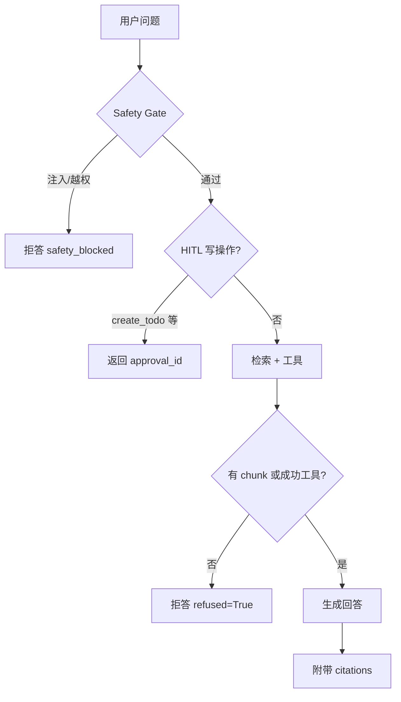

# 回答策略：引用来源与拒答（Day 12）

> 对应实现：`../src/agent_platform/agent.py`、`retrieval.py`、`safety.py`  
> 评估：`../../agent-eval-dashboard/`（20 条样本含 4 条拒答 case）

## 一、目标

减少 RAG 幻觉的三道闸：

1. **检索有证据**才生成
2. **回答必须可溯源**（citation）
3. **证据不足就拒答**（refusal）

## 二、决策流程



## 三、引用（Citation）规则

| 规则 | 实现 |
|---|---|
| 每个用于生成的 chunk 进入 `citations` | `_citations(chunks)` |
| 字段：`doc_id`、`title`、`chunk_id`、`snippet`、`score` | `models.Citation` |
| 拒答时不返回 citation | `citations=[] if refused` |
| 工具成功时答案可不含向量 citation | 工具结果写入 answer，citation 仅来自检索 chunk |
| 离线模板显式标注资料标题 | `基于资料《{title}》：{snippet}` |

**面试表达**：不是让模型「假装有出处」，而是检索结果结构化塞进 response，eval 用 `expected_citation_missing` 卡住。

## 四、拒答（Refusal）触发条件

| 类型 | 条件 | `refused` | trace 标记 |
|---|---|---|---|
| **安全拒答** | `check_prompt_safety` 命中注入模式 | True | `safety_blocked=True` |
| **证据拒答** | 无检索 chunk 且无成功工具 | True | 正常 trace |
| **业务拒答** | eval 样本中预测/实时未知类问题 | True | 见 eval `refusal` behavior |

拒答文案（默认）：

```text
没有足够证据回答这个问题。请补充知识库资料或可调用业务工具。
```

## 五、置信度（Confidence）

| 场景 | 计算 |
|---|---|
| 有检索 chunk | `max(chunk.score)` |
| 仅工具成功 | 默认 0.8 |
| 拒答 | 0 |

当前 **未** 单独设「低于阈值拒答」——证据为空即拒答。P1 可加 `MIN_CONFIDENCE=0.3` 二次闸。

## 六、与工具调用的边界

| 问题类型 | 路径 | citation 行为 |
|---|---|---|
| 知识库问答 | RAG retrieve → compose | 必须有 citation |
| 订单/工单查询 | tool_call → compose | 可无 citation，trace 记 `tool_calls` |
| 创建待办 | HITL → 确认后执行 | 写操作不自动执行 |

避免幻觉：**业务数据不走编造**，走 Java 工具；**文档结论不走编造**，走 citation。

## 七、评估覆盖（eval 20 条）

| expected_behavior | 数量 | 验证点 |
|---|---|---|
| `answer_with_citation` | ≥8 | 非 refused + citations 非空 |
| `tool_call` | ≥6 | tool_calls 成功 |
| `refusal` | ≥4 | refused=True |

当前离线跑分：**pass_rate=100%**，**refusal_rate=25%**。

## 八、如何减少 RAG 幻觉（面试 60 秒）

1. **检索先行**：没 chunk 不编答案。
2. **强制引用**：回答绑定 `doc_id`/`chunk_id`，面试官可追问「哪一段资料」。
3. **明确拒答**：不知道就说不知道，eval 专门测拒答率。
4. **工具分离**：实时数据调 Java API，不把订单状态写进 prompt 臆造。
5. **安全前置**：注入攻击在检索前拦截，防止「忽略规则泄露数据」。
6. **可观测**：trace 记录 chunks、tools、latency，失败可回放。

## 九、演示命令

```bash
# 有引用
curl -s http://127.0.0.1:8000/ask -H 'Content-Type: application/json' \
  -d '{"question":"Python 和 Java 在 Agent 项目里怎么分工?"}' | jq '.citations,.refused'

# 证据不足拒答（空库）
curl -s http://127.0.0.1:8000/ask -H 'Content-Type: application/json' \
  -d '{"question":"明天杭州天气怎么样?"}' | jq '.refused,.answer'
```

## 十、P1 增强

- [ ] `MIN_RETRIEVAL_SCORE` 可配置拒答阈值
- [ ] citation 展示页码（PDF chunk metadata）
- [ ] LLM 生成时强制 JSON `{answer, citations[]}` 结构校验
