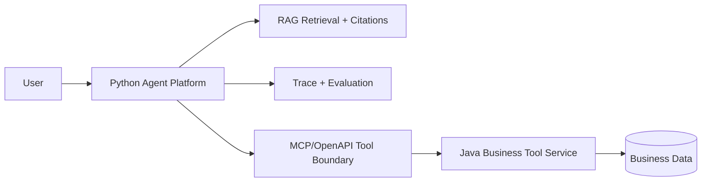
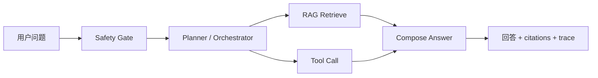

# Agent Platform Architecture

> **顶层架构定稿见 [docs/03-architecture-overview.md](../../../docs/03-architecture-overview.md)。** 本文只记录 Python 侧实现备注。

## Why Python Owns The AI Layer

Python is the better first implementation language for the AI layer because most practical Agent/RAG work happens around fast experiments:

- document parsing,
- chunking and retrieval,
- prompt and tool orchestration,
- LangGraph/LangChain workflows,
- LlamaIndex experiments,
- eval datasets,
- trace replay,
- future multimodal/OCR work.

The first month should optimize for learning speed, interview demos, and the ability to explain Agent/RAG internals. Python fits that better than forcing every AI concern into Java.

## Why Java Owns The Business Tool Layer

Java remains the user's advantage. Enterprise AI Agents need to call real systems:

- orders,
- tickets,
- CRM/ERP records,
- permissions,
- audit logs,
- transactions,
- idempotent writes,
- stable deployment.

Those are Java backend strengths. The right interview story is not "I abandoned Java"; it is "I use Python for AI orchestration and Java for reliable enterprise tools."

## Boundary

## Agent 工作流（Planner → Tool → Answer）

与纯 ChatBot「单轮生成」不同，本项目的 Agent 链路可规划、可调用工具、可观测：

实现入口：`graph_orchestrator.py`（节点：safety → retrieve → tools → compose）。写操作（如 `create_todo`）经 `approval.py` 人工确认后执行。

**面试一句话**：ChatBot 只生成文本；Agent 会根据问题选择检索或调 Java 业务工具，全程 trace 可回放，高风险动作有人工审批。

## Current MVP

The default MVP is deterministic:

- no model key,
- no vector database,
- no network dependency for `offline_demo()`,
- standard-library tests,
- explicit trace and evaluation outputs.

The optional Java HTTP tool adapter calls the Java Business Tool Service through a real local HTTP boundary, while keeping offline tests deterministic.

The optional OpenAI-compatible chat client can generate final answers from retrieved evidence and Java tool results. It is disabled unless `OPENAI_API_KEY` is configured, so tests and demos still work without a model key.

## Upgrade Path

1. Replace keyword retrieval with embeddings and Qdrant/pgvector. **Done.**
2. FastAPI endpoints for ingestion, question answering, traces, and summaries. **Done.**
3. Add LangGraph-style orchestration for stateful Agent workflows. **MVP done** (`graph_orchestrator.py`); official LangGraph package next.
4. Add LlamaIndex for document ingestion and indexing experiments.
5. Java Business Tool Service plus Python HTTP tool adapter. **Done.**
6. MCP/OpenAPI wrapper plus stdio MCP server. **Done.**
7. Docker Compose for Python + Java + Qdrant runtime. **Done.**
8. Hybrid retrieval + rerank path. **MVP done**; real rerank model next.
9. Prompt safety, session, HITL approval, SSE streaming, real Embedding adapter. **Done.**

## 技术选型定稿（Day 6）

> 决策依据：[docs/decisions/0001-python-java-hybrid.md](../../../docs/decisions/0001-python-java-hybrid.md)  
> 课程对照：`../../agent/part10-agent`（FastAPI）、`part05-agent-rag`（RAG）、`part04-agent-langchain`（Agent）

### 主栈一览

| 层级 | 技术 | 职责 | 作品集路径 |
|---|---|---|---|
| **AI 主链路** | Python 3.11+、FastAPI、Pydantic | RAG、Agent 编排、SSE、会话、安全 | `src/agent_platform/` |
| **LLM/Embedding** | OpenAI-compatible API | Chat + Embedding，env 开关 | `llm.py`、`embeddings.py` |
| **检索** | BM25 + 向量 + Qdrant | 混合检索、引用、拒答 | `hybrid_retrieval.py`、`vector_store.py` |
| **编排** | 自研状态机（LangGraph 风格） | safety → retrieve → tools → compose | `graph_orchestrator.py` |
| **业务工具** | Java 17、Spring Boot 3 | 订单/工单/待办、审计、幂等 | `portfolio/java-business-tool-service/` |
| **工具边界** | HTTP + OpenAPI + MCP stdio | Python↔Java 契约 | `java_tools.py`、`mcp-tool-server/` |
| **前端** | Next.js | 对话、流式、审批、eval 概览 | `portfolio/agent-web/` |
| **部署** | Docker Compose | Web + API + Java + Qdrant | `compose.yaml` |
| **评估** | JSONL + CLI | pass_rate、检索 MRR | `portfolio/agent-eval-dashboard/` |

### 为什么 Agent/RAG 用 Python（面试 60 秒）

1. **生态**：LangChain/LangGraph、LlamaIndex、Qdrant 客户端、eval 工具链都在 Python 优先。
2. **迭代速度**：Prompt、检索策略、工具编排需要高频实验；Python 更适合第一个月作品集和面试 demo。
3. **岗位匹配**：杭州 JD 高频词是「大模型应用 / Agent / RAG 工程落地」，不是「纯 Java 训练框架」。
4. **不是放弃 Java**：Java 5 年经验用在业务工具层（事务、幂等、审计），面试故事是「混合架构」而非「转语言」。

### 为什么业务工具层保留 Java

| 能力 | Java 优势 | 本项目证据 |
|---|---|---|
| 企业接口 | Spring Boot、校验、异常码 | `BusinessToolController` |
| 写操作安全 | 幂等 key、审计日志 | `IdempotencyService`、`AuditLog` |
| 稳定部署 | JVM 运维经验可迁移 | Docker Compose Java 服务 healthy |
| 面试差异化 | 5 年后端 → AI 应用，不是零基础 | STAR 讲法见 `docs/11-resume-and-interview-pack.md` |

### Spring AI 对比（Java 侧参考，非主实现）

| 维度 | Spring AI RAG | 本项目 Python RAG |
|---|---|---|
| 定位 | Java 生态内嵌 RAG | Python 主链路 + Java 工具 |
| 向量库 | 支持 pgvector 等 | Qdrant + 本地混合检索 |
| Agent | Spring AI Advisors | 自研 graph + tool registry |
| 何时提 | 面试对比、客户要求全 Java 栈 | 日常 demo 与作品集 |

参考：[Spring AI RAG 文档](https://docs.spring.io/spring-ai/reference/api/retrieval-augmented-generation.html)

### FastAPI 与课程映射

| 课程概念（part10） | 本项目实现 |
|---|---|
| 路由与 Pydantic 模型 | `DocumentPayload`、`QuestionPayload` |
| 依赖注入 / 应用工厂 | `create_app(platform=...)` 便于测试 |
| 中间件 | CORS 允许 `agent-web:3000` |
| 流式响应 | `POST /ask/stream` → `StreamingResponse` |
| 健康检查 | `GET /health` → Compose 探活 |

学习笔记见 [notes-fastapi.md](notes-fastapi.md)。

### 明确不选（第一个月）

- **纯 Java Agent/RAG**：学习曲线长，JD 作品集证据弱。
- **Python + TS 替代 Java**：TypeScript 已用于 Web UI，不替代业务工具层。
- **自训大模型**：岗位定位是应用工程，不是算法研究。
