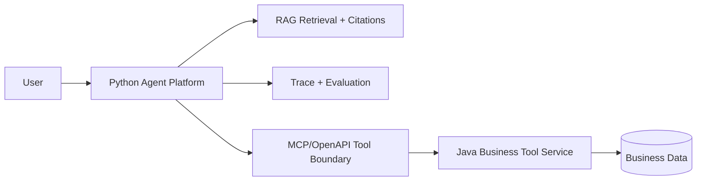

# Agent Platform Architecture

## Why Python First

Python is the better first implementation language for the AI layer because most practical Agent/RAG work happens around fast experiments:

- document parsing,
- chunking and retrieval,
- prompt and tool orchestration,
- LangGraph/LangChain workflows,
- LlamaIndex experiments,
- eval datasets,
- trace replay,
- future multimodal/OCR work.

The first month should optimize for learning speed, interview demos, and the ability to explain Agent/RAG internals. Python fits that better than forcing every AI concern into Java.

## Why Keep Java

Java remains the user's advantage. Enterprise AI Agents need to call real systems:

- orders,
- tickets,
- CRM/ERP records,
- permissions,
- audit logs,
- transactions,
- idempotent writes,
- stable deployment.

Those are Java backend strengths. The right interview story is not "I abandoned Java"; it is "I use Python for AI orchestration and Java for reliable enterprise tools."

## Boundary

## Current MVP

The MVP is deterministic:

- no model key,
- no vector database,
- no network dependency,
- standard-library tests,
- explicit trace and evaluation outputs.

This proves behavior before adding frameworks.

## Upgrade Path

1. Replace keyword retrieval with embeddings and Qdrant/pgvector.
2. Add FastAPI endpoints for ingestion, question answering, traces, and summaries.
3. Add LangGraph for stateful Agent workflows.
4. Add LlamaIndex for document ingestion and indexing experiments.
5. Add Java Business Tool Service and connect it through MCP/OpenAPI.
6. Add Docker Compose for Python + Java + vector database.

