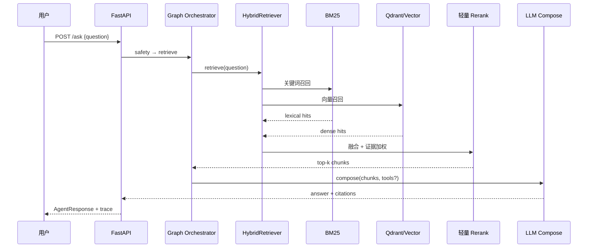

# RAG 检索链路时序（Day 11）

> 课程：`../../../../agent/part05-agent-rag/Part 5. 大模型RAG检索生成和评估实战`

## Query → Retrieve → Rerank → Generate

## 各阶段职责

| 阶段 | 模块 | 输出 |
|---|---|---|
| Retrieve | `BM25Retriever` + `LocalVectorRetriever` / `QdrantRetriever` | 候选 chunk 列表 |
| Rerank | `HybridRetriever._rerank` | 融合分 + 排序 |
| Generate | `_compose` / `OpenAICompatibleChatClient` | 带引用回答或拒答 |
| 评估 | `agent-eval-dashboard` + `retrieval_eval` | pass_rate、MRR |

## 拒答条件

- 无 chunk 且无成功工具结果 → `refused=True`
- Prompt 注入 → `safety_blocked`（检索前拦截）

## 面试一句话

检索不是「只取向量 top1」，而是 **BM25 补关键词、向量补语义、融合排序后带引用生成**；证据不足就拒答。

## 代码入口

- `retrieval.py`：`HybridRetriever`
- `agent.py`：`_compose`、`_citations`
- 评估：`portfolio/agent-eval-dashboard/`、`data/retrieval_eval_dataset.jsonl`
