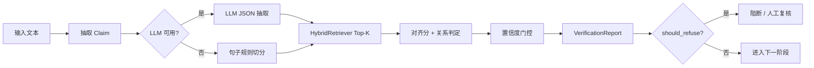

# 查证型知识库：Claim-Evidence 流程

> 更新：2026-07-08 · 项目优先 D8  
> 代码：`src/agent_platform/verified_knowledge.py`

## 一、数据模型

```text
Claim（主张）
  ↕ ClaimEvidenceLink（对齐关系 + 分数）
Evidence（证据片段，来自 KB / DeepResearch / 人工）
  → VerifiedClaim（单条核验结果 + status + confidence）
  → VerificationReport（批次报告 + should_refuse）
```

| 类型 | 字段要点 |
|---|---|
| `Claim` | `claim_id`, `text`, `source_stage` |
| `Evidence` | `doc_id`, `chunk_id`, `snippet`, `score`, `source_type` |
| `ClaimEvidenceLink` | `relation`（supports/partial/contradicts/unrelated）, `alignment_score` |
| `VerifiedClaimStatus` | `verified` / `pending_review` / `unverified` / `contradicted` |

## 二、处理流程



## 三、门控阈值（默认）

| 参数 | 值 | 含义 |
|---|---:|---|
| `verify_threshold` | 0.55 | ≥ 视为 verified |
| `refuse_threshold` | 0.35 | < 整体均值则 should_refuse |
| 中间带 | 0.35～0.55 | `pending_review`，Web 标黄 |

## 四、与 ProjectForge 集成

| 阶段 | 是否查证 |
|---|---|
| ① 调研 | 否（DeepResearch 脚注） |
| ② 原型 | 否 |
| ③ 架构 | **是** |
| ④ 方案 | **是** |
| ⑤ PRD | **是** |
| ⑥～⑨ | 否（或抽样） |

API：`POST /verified-knowledge/verify`  
Forge 演示：`POST /project-forge/demo` 自动在 ③④⑤ 挂载 `verification`。

## 五、评估

数据集：`data/verification_eval_dataset.jsonl`（8 条）

指标：
- `verified_rate`：status=verified 占比
- `refusal_rate`：should_refuse=true 占比
- `contradiction_rate`：contradicted 占比

## 六、P1 增强

1. Cross-encoder Rerank 后再对齐
2. DeepResearch 来源作为 `EvidenceSourceType.DEEP_RESEARCH`
3. HITL 审核队列（pending_review → 人工确认）
