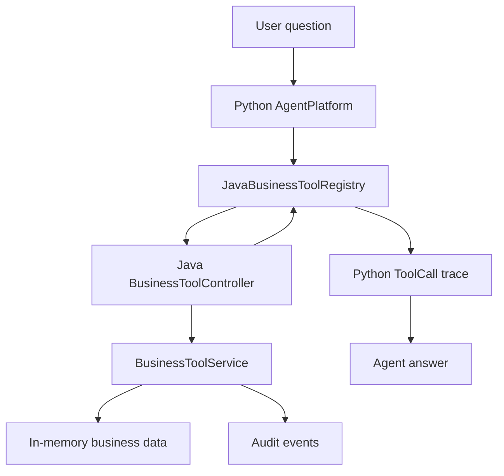
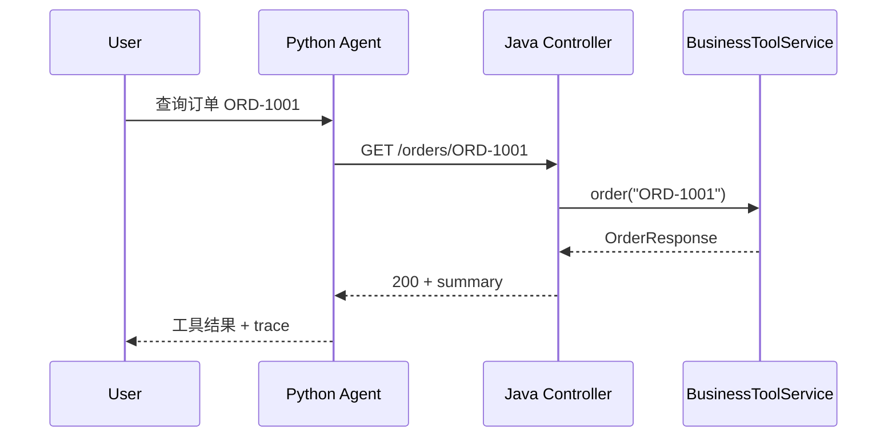

# Java Business Tool API Handoff

## 联调摘要

目标：把 Java Business Tool Service 的订单、工单、待办和审计能力整理成 Agent/前端可消费的工具契约。

- Java 服务：`portfolio/java-business-tool-service/`
- 默认本地地址：`http://127.0.0.1:8080`
- OpenAPI：`portfolio/mcp-tool-server/openapi.json`
- MCP-ready manifest：`portfolio/mcp-tool-server/mcp-tools.json`
- Python 消费方：`portfolio/agent-platform/src/agent_platform/java_tools.py`

当前没有鉴权；生产化时需要在 MCP/OpenAPI wrapper 层加入工具白名单、用户身份、权限、审计和高风险人工确认。

## 接口清单

| 场景 | 方法 | 路径 | operationId | 前端/Agent 是否调用 |
|---|---|---|---|---|
| 健康检查 | `GET` | `/health` | `health` | 是，部署探活 |
| 工具清单 | `GET` | `/tools` | `listTools` | 是，Agent 工具发现 |
| 订单查询 | `GET` | `/orders/{orderId}` | `getOrderStatus` | 是 |
| 工单查询 | `GET` | `/tickets/{ticketId}` | `getTicketStatus` | 是 |
| 创建待办 | `POST` | `/todos` | `createTodo` | 是 |
| 审计事件 | `GET` | `/audit-events` | `listAuditEvents` | 是，演示和排查 |

## 主流程图



## 时序图



## 代码顺序表

| 顺序 | 层 | 文件 | 方法/行号 | 职责 |
|---|---|---|---|---|
| 1 | Controller | `portfolio/java-business-tool-service/src/main/java/com/shuang/aiagent/tools/api/BusinessToolController.java` | `health`:31 | 服务健康检查 |
| 2 | Controller | `portfolio/java-business-tool-service/src/main/java/com/shuang/aiagent/tools/api/BusinessToolController.java` | `tools`:36 | 返回工具清单 |
| 3 | Controller | `portfolio/java-business-tool-service/src/main/java/com/shuang/aiagent/tools/api/BusinessToolController.java` | `order`:41 | 接收订单查询 |
| 4 | Controller | `portfolio/java-business-tool-service/src/main/java/com/shuang/aiagent/tools/api/BusinessToolController.java` | `ticket`:46 | 接收工单查询 |
| 5 | Controller | `portfolio/java-business-tool-service/src/main/java/com/shuang/aiagent/tools/api/BusinessToolController.java` | `createTodo`:51 | 接收待办创建 |
| 6 | Controller | `portfolio/java-business-tool-service/src/main/java/com/shuang/aiagent/tools/api/BusinessToolController.java` | `auditEvents`:56 | 返回审计事件 |
| 7 | Error | `portfolio/java-business-tool-service/src/main/java/com/shuang/aiagent/tools/api/BusinessToolController.java` | `handleBusinessToolException`:61 | 转结构化错误 |
| 8 | Service | `portfolio/java-business-tool-service/src/main/java/com/shuang/aiagent/tools/core/BusinessToolService.java` | `tools`:45 | 定义工具名和必填参数 |
| 9 | Service | `portfolio/java-business-tool-service/src/main/java/com/shuang/aiagent/tools/core/BusinessToolService.java` | `order`:53 | 查订单并记录审计 |
| 10 | Service | `portfolio/java-business-tool-service/src/main/java/com/shuang/aiagent/tools/core/BusinessToolService.java` | `ticket`:67 | 查工单并记录审计 |
| 11 | Service | `portfolio/java-business-tool-service/src/main/java/com/shuang/aiagent/tools/core/BusinessToolService.java` | `createTodo`:81 | 幂等创建待办 |
| 12 | Service | `portfolio/java-business-tool-service/src/main/java/com/shuang/aiagent/tools/core/BusinessToolService.java` | `record`:100 | 写审计事件 |

## 请求字段

### `GET /orders/{orderId}`

| 字段 | 类型 | 必填 | 来源 | 示例 | 说明 |
|---|---|---|---|---|---|
| `orderId` | string | 是 | path | `ORD-1001` | 业务订单号 |

### `GET /tickets/{ticketId}`

| 字段 | 类型 | 必填 | 来源 | 示例 | 说明 |
|---|---|---|---|---|---|
| `ticketId` | string | 是 | path | `TCK-1001` | 业务工单号 |

### `POST /todos`

| 字段 | 类型 | 必填 | 来源 | 示例 | 说明 |
|---|---|---|---|---|---|
| `title` | string | 是 | body | `Follow up customer` | 待办标题 |
| `idempotencyKey` | string | 是 | body | `idem-1` | 幂等键，避免重复创建 |

## 响应字段

### `OrderResponse`

| 字段 | 类型 | 前端/Agent 用途 | 示例 |
|---|---|---|---|
| `orderId` | string | 展示和 trace | `ORD-1001` |
| `status` | string | 状态判断 | `shipped` |
| `eta` | string | 到达时间说明 | `tomorrow` |
| `summary` | string | 直接进入 Agent 回答 | `订单 ORD-1001 当前状态：已发货，预计明日送达。` |

### `TicketResponse`

| 字段 | 类型 | 前端/Agent 用途 | 示例 |
|---|---|---|---|
| `ticketId` | string | 展示和 trace | `TCK-1001` |
| `status` | string | 状态判断 | `processing` |
| `owner` | string | 责任方展示 | `support-team` |
| `summary` | string | 直接进入 Agent 回答 | `工单 TCK-1001 当前状态：处理中。` |

### `TodoResponse`

| 字段 | 类型 | 前端/Agent 用途 | 示例 |
|---|---|---|---|
| `todoId` | string | 展示和 trace | `TODO-1` |
| `title` | string | 待办展示 | `Follow up customer` |
| `status` | string | 创建状态 | `created` |

## 错误码和失败分支

| 错误码 | HTTP | 触发条件 | Agent 处理建议 |
|---|---:|---|---|
| `ORDER_NOT_FOUND` | 404 | 订单不存在 | 标记工具失败；无其他证据时拒答 |
| `TICKET_NOT_FOUND` | 404 | 工单不存在 | 标记工具失败；无其他证据时拒答 |
| `VALIDATION_ERROR` | 400 | 待办请求缺必填字段 | 不重试；提示参数缺失 |

## MCP-ready 工具映射

| MCP tool | inputSchema required | HTTP operationId | HTTP path |
|---|---|---|---|
| `get_order_status` | `orderId` | `getOrderStatus` | `/orders/{orderId}` |
| `get_ticket_status` | `ticketId` | `getTicketStatus` | `/tickets/{ticketId}` |
| `create_todo` | `title`, `idempotencyKey` | `createTodo` | `/todos` |

`mcp-tools.json` 采用 MCP `tools/list` 风格字段：`name`、`description`、`inputSchema`。其中 `http` 字段是本项目附加映射，用于未来 MCP server wrapper 把 `tools/call` 转成 Java HTTP 请求。

## 风险和待确认项

| 风险 | 当前结论 |
|---|---|
| 鉴权/租户 | 当前 MVP 未实现；生产化必须加 |
| 幂等 | `create_todo` 已用 `idempotencyKey` |
| 审计 | 成功/失败工具调用会记录 audit event |
| 错误结构 | 业务异常返回 `code` 和 `message` |
| MCP runtime | 当前只交付 contract，不声明完整 MCP server |

## 验证记录

运行：

```bash
cd portfolio/mcp-tool-server
python3 -m unittest discover -s tests -v
python3 -m json.tool openapi.json >/tmp/ai-agent-openapi.json
python3 -m json.tool mcp-tools.json >/tmp/ai-agent-mcp-tools.json
```

联调：

```bash
cd portfolio/java-business-tool-service
mvn spring-boot:run

curl http://127.0.0.1:8080/tools
curl http://127.0.0.1:8080/orders/ORD-1001
curl http://127.0.0.1:8080/tickets/TCK-1001
curl -X POST http://127.0.0.1:8080/todos \
  -H 'Content-Type: application/json' \
  -d '{"title":"Follow up customer","idempotencyKey":"idem-1"}'
```

