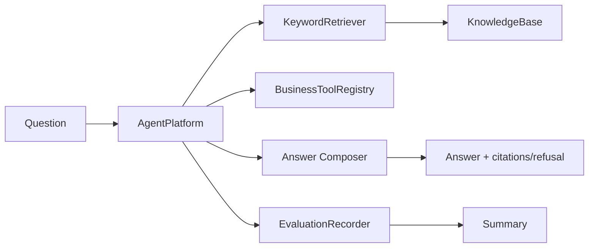

# Feature 001 Plan

## File Structure

```text
portfolio/agent-platform/
  README.md
  pyproject.toml
  src/agent_platform/
    __init__.py
    agent.py
    evaluation.py
    knowledge_base.py
    models.py
    retrieval.py
    tools.py
  tests/
    test_agent_core.py
  data/
    eval_dataset.jsonl
  docs/
    architecture.md
```

## Data Flow



## Technology Baseline

- Python 3.11+ for the Agent/RAG/evaluation layer.
- Standard library first for deterministic tests.
- Future API adapter: FastAPI.
- Future orchestration adapter: LangGraph.
- Future RAG adapter: LlamaIndex or LangChain retriever components.
- Java/Spring Boot stays as a separate business tool API layer.

## Risks and Mitigations

- Risk: Python project looks too simple. Mitigation: make traces, refusal, tool calls, eval summary, and architecture docs explicit.
- Risk: Java advantage disappears. Mitigation: document Java as business/tool service layer and keep `mcp-tool-server` as integration project.
- Risk: user over-learns Python frameworks. Mitigation: one-month plan keeps Python focused on Agent/RAG and uses Java for business integration story.

