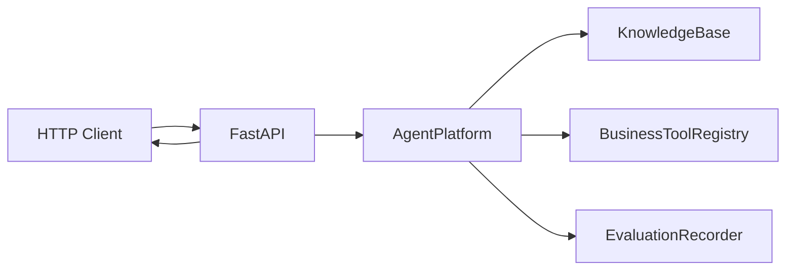

# Feature 002 Plan

## File Structure

```text
portfolio/agent-platform/
  pyproject.toml
  src/agent_platform/
    api.py
    agent.py
    models.py
  tests/
    test_api.py
```

## Data Flow



## Dependencies

- FastAPI
- Uvicorn standard extra for local running
- Test dependency: FastAPI TestClient via Starlette/httpx

## API Contract

### `POST /documents`

Request:

```json
{"doc_id":"rag","title":"RAG Guide","content":"RAG uses retrieval and citations."}
```

Response:

```json
{"accepted":true,"doc_id":"rag"}
```

### `POST /ask`

Request:

```json
{"question":"RAG uses what?"}
```

Response fields:

- `answer`
- `refused`
- `confidence`
- `citations`
- `trace`

### `GET /summary`

Returns `total_runs`, `refusal_count`, `tool_call_count`, `tool_success_count`, `average_latency_ms`.

### `GET /tools`

Returns available deterministic tool names.

## Risks

- FastAPI dependency not installed globally. Mitigation: project `.venv` is used for verification and dependencies are declared in `pyproject.toml`.
- In-memory API state resets per process. Mitigation: acceptable for MVP and documented clearly.

