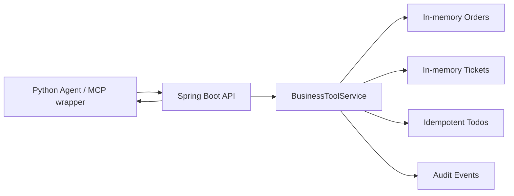

# Feature 003 Plan

## File Structure

```text
portfolio/java-business-tool-service/
  pom.xml
  src/main/java/com/shuang/aiagent/tools/
    JavaBusinessToolServiceApplication.java
    api/BusinessToolController.java
    core/BusinessToolService.java
    model/*.java
  src/test/java/com/shuang/aiagent/tools/api/
    BusinessToolControllerTest.java
```

## Data Flow



## Dependencies

- Java 21 target.
- Spring Boot 3.5.0.
- Spring Web.
- Spring Validation.
- Spring Boot Test.

## API Contract

### `GET /tools`

Returns tool metadata:

- `get_order_status`
- `get_ticket_status`
- `create_todo`

Each tool includes name, description, and required parameter names.

### `GET /orders/{orderId}`

Known fixture:

- `ORD-1001`: shipped, ETA tomorrow.

### `GET /tickets/{ticketId}`

Known fixture:

- `TCK-1001`: processing.

### `POST /todos`

Request:

```json
{"title":"Follow up customer","idempotencyKey":"idem-1"}
```

Response:

```json
{"todoId":"TODO-1","title":"Follow up customer","status":"created"}
```

### `GET /audit-events`

Returns deterministic audit events for tool calls.

