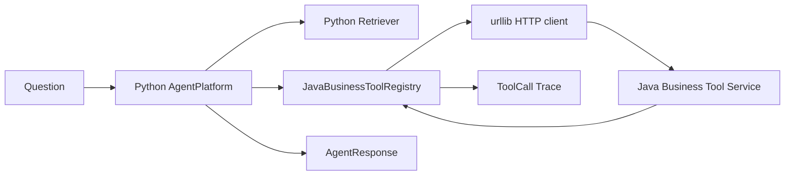

# Feature 004 Plan

## File Structure

```text
portfolio/agent-platform/
  src/agent_platform/
    agent.py
    java_tools.py
    tools.py
  tests/
    test_agent_core.py
    test_java_tools.py
specs/004-agent-java-tool-integration/
  spec.md
  plan.md
  tasks.md
  state.md
  session.md
```

## Integration Boundary



## Design

- Keep `BusinessToolRegistry` as the deterministic offline registry.
- Introduce `JavaBusinessToolRegistry` with the same public shape: `names()` and `invoke(question)`.
- Add `AgentPlatform.with_java_tools(base_url)` as a second constructor.
- Use Python standard library `urllib.request` to avoid adding dependency ambiguity around `httpx2`.
- Convert every Java response into existing `ToolCall` dataclasses so evaluation and API serialization keep working.
- Do not make the existing FastAPI app require Java. It still defaults to `offline_demo()`; Java-backed app creation can be added later.

## HTTP Contract

### `GET /tools`

Expected Java response shape:

```json
{
  "tools": [
    {"name": "get_order_status", "description": "...", "requiredParameters": ["orderId"]}
  ]
}
```

Python uses only `name` for AC1.

### `GET /orders/{orderId}`

Success:

```json
{"orderId":"ORD-1001","status":"shipped","eta":"tomorrow","summary":"订单 ORD-1001 当前状态：已发货，预计明日送达。"}
```

404:

```json
{"code":"ORDER_NOT_FOUND","message":"Order ORD-9999 was not found"}
```

### `GET /tickets/{ticketId}`

Success:

```json
{"ticketId":"TCK-1001","status":"processing","owner":"support-team","summary":"工单 TCK-1001 当前状态：处理中。"}
```

### `POST /todos`

Request:

```json
{"title":"创建待办：跟进客户","idempotencyKey":"agent-<hash>"}
```

Success:

```json
{"todoId":"TODO-1","title":"创建待办：跟进客户","status":"created"}
```

## Tests

L1 Python unit tests:

- Start an in-process standard-library HTTP server with Java-compatible responses.
- Verify tool metadata, order success, ticket success, todo success, and 404 mapping.
- Verify `AgentPlatform.with_java_tools()` composes answers and traces with the Java-backed registry.
- Verify `offline_demo()` behavior remains unchanged.

L2 local slice smoke:

- Run Java service on a local port.
- Call its `/health` endpoint.
- Run a Python unittest that points `JavaBusinessToolRegistry` at the running Java service.
- Tear down Java process after verification.

## Risks

- Port conflicts when running Java locally. Mitigation: use a dynamic or explicit local port in verification scripts/commands.
- Java startup time. Mitigation: wait on `/health` with bounded retries.
- HTTP client failure handling. Mitigation: map connection and HTTP errors to failed `ToolCall` objects instead of crashing the Agent for normal tool failures.

