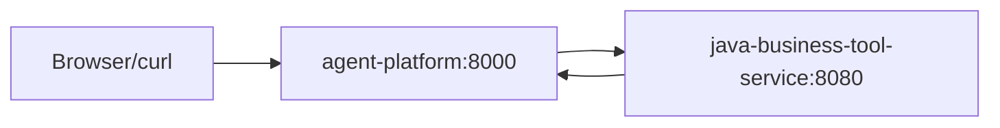

# Feature 006 Plan

## File Structure

```text
compose.yaml
tests/
  test_docker_artifacts.py
portfolio/agent-platform/
  Dockerfile
  .dockerignore
  src/agent_platform/api.py
  tests/test_api.py
portfolio/java-business-tool-service/
  Dockerfile
  .dockerignore
specs/006-docker-compose-runtime/
  spec.md
  plan.md
  tasks.md
  state.md
  session.md
```

## Runtime Topology



## Compose Design

- `java-business-tool-service`
  - Build context: `portfolio/java-business-tool-service`
  - Container port: `8080`
  - Host port: `8080`
  - Health check: `GET /health`
- `agent-platform`
  - Build context: `portfolio/agent-platform`
  - Container port: `8000`
  - Host port: `8000`
  - Environment: `JAVA_TOOL_BASE_URL=http://java-business-tool-service:8080`
  - Depends on Java service health

## Python API Wiring

`create_app(platform=None)` should use:

- explicit `platform` when provided, for tests and embedding;
- `AgentPlatform.with_java_tools(os.environ["JAVA_TOOL_BASE_URL"])` when env is set;
- `AgentPlatform.offline_demo()` otherwise.

## Tests

- Root test verifies `compose.yaml`, Dockerfiles, `.dockerignore`, service names, ports, env, health checks, and commands.
- Python API test verifies env-based Java tool wiring using the existing in-process Java-like test service.
- `docker compose -f compose.yaml config` validates Compose syntax when Docker CLI is available.

## Verification Limits

Docker daemon is not always running in Codex sessions. If daemon is unavailable, `docker compose config` plus artifact and unit tests are the required gate. If daemon is running, run `docker compose up --build` and smoke-test both health endpoints.
