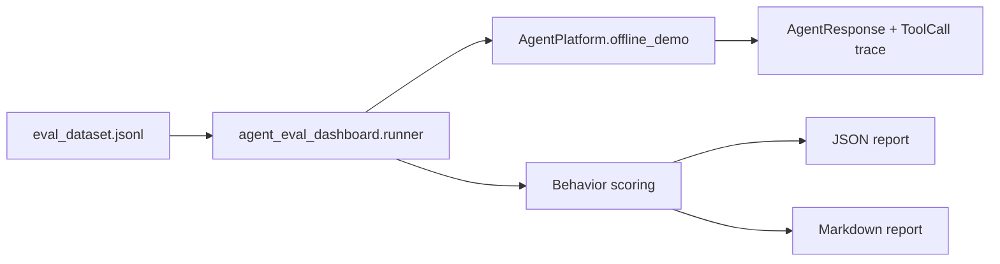

# Feature 007 Plan

## File Structure

```text
portfolio/agent-eval-dashboard/
  README.md
  pyproject.toml
  src/agent_eval_dashboard/
    __init__.py
    cli.py
    runner.py
  tests/test_eval_dashboard.py
specs/007-agent-eval-dashboard/
  spec.md
  plan.md
  tasks.md
  state.md
  session.md
```

## Design

The dashboard stays Python-only and consumes the existing Agent Platform:



## Scoring Rules

- `answer_with_citation`: pass when the Agent did not refuse and returned at least one citation.
- `tool_call`: pass when the trace has at least one successful tool call.
- `refusal`: pass when the Agent refused.

Failure categories:

- `passed`
- `unexpected_refusal`
- `expected_citation_missing`
- `expected_tool_call_missing`
- `tool_call_failed`
- `expected_refusal_missing`
- `unknown_expected_behavior`

## CLI

Run from `portfolio/agent-eval-dashboard`:

```bash
PYTHONPATH=../agent-platform/src:src python -m agent_eval_dashboard.cli \
  --dataset ../agent-platform/data/eval_dataset.jsonl \
  --json-out reports/latest.json \
  --md-out reports/latest.md
```

## Tests

Use stdlib `unittest` only. Tests set `sys.path` to import both:

- `portfolio/agent-platform/src`
- `portfolio/agent-eval-dashboard/src`

## Verification

- `PYTHONPATH=../agent-platform/src:src python3 -m unittest discover -s tests -v`
- Existing Agent Platform unittest suite.
- Root Docker artifact tests.
