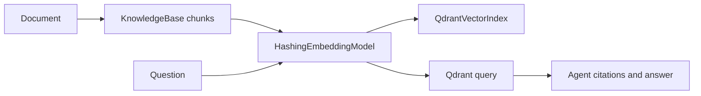

# Feature 011 Plan

## Files

```text
portfolio/agent-platform/src/agent_platform/vector_store.py
portfolio/agent-platform/src/agent_platform/agent.py
portfolio/agent-platform/src/agent_platform/api.py
portfolio/agent-platform/tests/test_vector_store.py
portfolio/agent-platform/tests/test_api.py
portfolio/agent-platform/README.md
compose.yaml
docs/project-completion-audit.md
logs/daily/2026-06-26.md
```

## Design

Use a small deterministic hashing embedding for local proof and tests. Use Qdrant's HTTP API through the Python standard library:

- `PUT /collections/{collection}` to ensure a cosine vector collection exists.
- `PUT /collections/{collection}/points?wait=true` to upsert chunk vectors.
- `POST /collections/{collection}/points/query` to query nearest points.



## Verification

- RED: `cd portfolio/agent-platform && .venv/bin/python -m unittest tests.test_vector_store -v` fails because `agent_platform.vector_store` does not exist.
- GREEN: same test passes after implementation.
- Full Agent Platform tests.
- Root Docker artifact tests.
- `docker compose -f compose.yaml config`.
- If Docker daemon is available, Compose smoke with Qdrant health and `/ask`.
