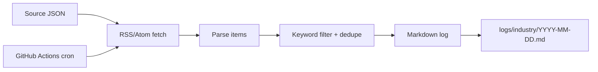

# Feature 013 Plan

## Files

```text
docs/14-industry-watch-sources.json
scripts/industry_watch.py
tests/test_industry_watch.py
.github/workflows/industry-watch.yml
docs/14-ai-industry-watch.md
docs/13-project-completion-audit.md
logs/daily/2026-06-26.md
logs/industry/YYYY-MM-DD.md
specs/013-industry-watch-automation/state.md
```

## Design

Use Python standard library only:

- `docs/14-industry-watch-sources.json` defines source name, feed URL, credibility, keywords, and impact areas.
- `scripts/industry_watch.py` fetches feeds with `urllib`, parses RSS/Atom with `xml.etree.ElementTree`, strips HTML, filters relevance, deduplicates by link/title, and writes Markdown.
- GitHub Actions runs the script daily at 01:00 UTC, which is 09:00 Beijing time, and commits log changes if any.
- The collector records source failures under `待复核` instead of failing the whole daily run.



## Verification

- RED: `python3 -m unittest tests.test_industry_watch -v` fails before `scripts.industry_watch` exists.
- GREEN: same test passes after implementation.
- Local run: `python3 scripts/industry_watch.py --sources docs/14-industry-watch-sources.json --out-dir logs/industry --date 2026-06-26 --max-items 8`.
- Existing project tests that are cheap and affected by docs/scripts:
  - `python3 -m unittest discover -s tests -v`
  - `git diff --check`
  - `python3 -m json.tool docs/14-industry-watch-sources.json`
